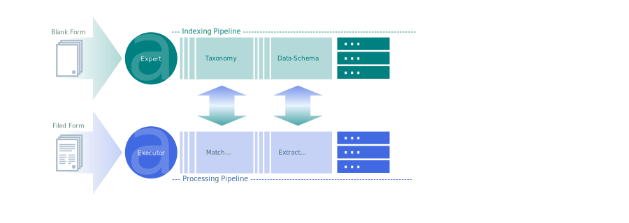

# DOCA: docs-agent
The project objective is to build a `stateful` AI agent for visual documents understanding and `LLM`-enabled navigation and data extraction.

For the example workload we used tax-form documents: the initial (pre-LLM) problem stated as visual layout understanding enabling high-precision data extraction from multi-page documents with a high number of different classes to recognize, and potentially sensitive user data which must be properly protected; the targeted end-user is a medium-level tax professional which has neither top-legal nor top-tech expertize.

* Explore: balance between general and specialized approach
* Leverage:
    * [form-blanks availability](notebooks/data/IRS-Forms.ipynb) and presence of the taxonomy markers on the pages
    * [synthetic data](notebooks/Data-Synth.ipynb)
    * agents:
        * `expert-agent` for high level generic interactions (QA on form-blanks and topic-expansion research) -- external LLM
        * `executor-agent` for operational interaction with potentially sensitive data (filled-in forms processing) -- local finetune
    * RLHF
* Priorities: precision, security and cost-efficiency

### Content:
* [System design considerations](#design)
* [R&D environment setup](#setup)
* Data gathering
    * [Tax-Forms](notebooks/data/IRS-Forms.ipynb)
    * [Exploration](notebooks/Data-Exploration.ipynb)
    * [PDF-Extraction](notebooks/Data-Evaluation.ipynb)
* Data modeling
    * [Doc-Data-Schema](notebooks/Doc-Data-Schema.ipynb)
    * [Doc-Identification-Baseline](notebooks/Doc-Identification-Baseline.ipynb)
    * [Doc-Indexing-Pipeline](notebooks/Doc-Indexing-Pipeline.ipynb)
    * [Doc-Indexing](notebooks/Doc-Indexing.ipynb)
* Visual modeling
    * [Rendering](notebooks/Visual-Rendering.ipynb)
    * Backbone: [CNN](notebooks/Visual-Backbone-CNN.ipynb), [ViT](./Visual-Backbone-ViT.ipynb)
    * [Classification](notebooks/Visual-Classification-Baseline.ipynb)
    * [Segmentation](notebooks/Visual-Segmentation-CNN.ipynb)
    * Extraction
        * [OCR](notebooks/OCR-Prep.ipynb)
        * [Tesseract](notebooks/OCR-Tesseract.ipynb)
* LLM Agents
    * Expert-Agent
    * Executer-Agent
* User interface
* Production considerations
* Research areas

<a name="design"></a>

### System design considerations

* [Indexing Pipeline](notebooks/Doc-Indexing.ipynb):
Tax-forms come in many types ([IRS has thousands](notebooks/data/IRS-Forms.ipynb)), might be multi-page, multiple versions and layouts for the same type which makes downstream validation and classification tasks quite difficult. Even more so, if we only count on the historic data (actual filed forms) to train the models: sensitive content, seasonal drift etc. Our approach is `indexing` form-blanks to extract most stable invariants and build a knowledge-base prior to the actual filed data starts to flow in. We make a use of both: sparse and dense representations and retrieval. We build `semantic-index` and extract form-inputs `data-schema` -- layout invariant.

    * [Expert-Agent](./agents/Expert-Agent.ipynb):
    the `LLM` based `LangChain` agent facilitating the form-blanks indexing. This agent never sees the actual filed forms, it only helps to build and maintain our knowledge-base, we can use any suited option for `LLM` here.

    * [Databases](./Indexing-Pipeline.ipynb): `Qdrant` (handles both `text` and `image` embeddings) + `ElasticSearch` (handles exact and keyword matches, and some spatial relations in layouts)

* [Processing Pipeline](notebooks/Processing-Pipeline.ipynb):

    * [Executer-Agent](agents/Executer-Agent.ipynb):
    a custom local model based `LangChain` agent with visual perception helping to process and validate the actual filed documents.

    * [Filed documents (main) storage](#):
    a read-only document database, optimized for full-text search (`ElasticSearch` for example).



<a name="setup"></a>

### R&D environment setup

    root/
    ├── Dockerfile
    ├── docker-compose.yml
    ├── requirements.txt
    ├── init.cnf               -- example of env-configuration file
    ├── build.sh
    ├── run.sh
    ├── research/              -- notebooks server root
    │   ├── ...
    │   ├── data/
    │   │   ├── ...
    │   │   ├── forms/         -- original PDF files (multi page)
    │   │   ├── images/        -- images of pages (single page)
    │   │   ├── info/          -- layout data: block-type, bounding-box, textual content
    │   │   ├── masks/         -- semantic segmentation targets
    │   │   └── ...
    │   ├── ...
    │   ├── models/            -- trained models weights
    │   ├── scripts/           -- local python utilities
    │   ├── runs/              -- training logs for `tensorboard` 
    │   └── ...
    │
    └── app/
        ├── .../
        │   ├── ...
        │   └── ...
        └── ...    
    
    
### Test installation


```python
!python --version
```

    Python 3.10.12


```python
# check local time
import datetime; print(datetime.datetime.now())
```

    2023-11-14 15:08:49.302973


```python
!nvidia-smi
```

    Tue Nov 14 15:08:49 2023
    +-----------------------------------------------------------------------------+
    | NVIDIA-SMI 525.147.05   Driver Version: 525.147.05   CUDA Version: 12.0     |
    |-------------------------------+----------------------+----------------------+
    | GPU  Name        Persistence-M| Bus-Id        Disp.A | Volatile Uncorr. ECC |
    | Fan  Temp  Perf  Pwr:Usage/Cap|         Memory-Usage | GPU-Util  Compute M. |
    |                               |                      |               MIG M. |
    |===============================+======================+======================|
    |   0  NVIDIA GeForce ...  Off  | 00000000:08:00.0  On |                  N/A |
    | 38%   31C    P8    16W / 120W |   3132MiB /  6144MiB |     15%      Default |
    |                               |                      |                  N/A |
    +-------------------------------+----------------------+----------------------+
                                                                                   
    +-----------------------------------------------------------------------------+
    | Processes:                                                                  |
    |  GPU   GI   CI        PID   Type   Process name                  GPU Memory |
    |        ID   ID                                                   Usage      |
    |=============================================================================|
    +-----------------------------------------------------------------------------+


```python
import torch; print('GPU' if torch.cuda.is_available() else 'CPU'); print(torch.__version__)
```

    GPU
    2.0.1+cu118


```python
import jax; print(jax. __version__)
```

    0.4.14


```python
import cv2; print(cv2. __version__)
```

    4.8.0


```python
import pytesseract; print(pytesseract.get_tesseract_version())
```

    5.3.2


```python
import fitz; print(fitz.__doc__)
```

    
    PyMuPDF 1.22.5: Python bindings for the MuPDF 1.22.2 library.
    Version date: 2023-06-21 00:00:01.
    Built for Python 3.10 on linux (64-bit).


```python
# generate requirements
#!pip freeze > requirements.txt
```
